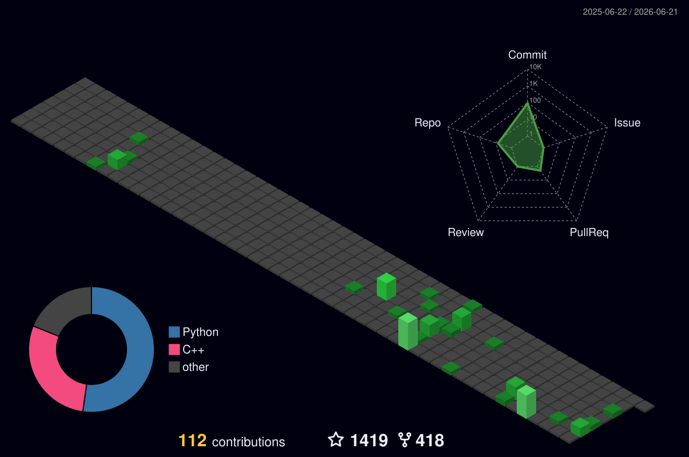

<!-- ═══════════════════════════════════════════════════════════════════════════════════ -->
<!-- ██████╗██╗   ██╗██████╗ ███████╗██████╗ ██╗  ██╗ █████╗ ██╗     ██╗      █████╗ ███╗   ██╗ -->
<!-- ╚══════╝╚═╝   ╚═╝╚═════╝ ╚══════╝╚═╝  ╚═╝╚═╝  ╚═╝╚═╝  ╚═╝╚══════╝╚══════╝╚═╝  ╚═╝╚═╝ ╚═══╝ -->
<!-- ═══════════════════════════════════════════════════════════════════════════════════ -->

<!-- ANIMATED TYPING HEADER -->
<p align="center">
  <a href="https://github.com/malikali4129">
    
  </a>
</p>

<!-- 🎬 PROFILE GIF 🎬 -->
<p align="center">
  
</p>

<!-- PROFILE BADGES -->
<p align="center">
  
  &nbsp;&nbsp;
  
  &nbsp;&nbsp;
  
</p>

<!-- PREMIUM DIVIDER -->


<!-- ╔══════════════════════════════════════════════════════════════╗ -->
<!-- ║                          💫 PROFILE 💫                   ║ -->
<!-- ╚══════════════════════════════════════════════════════════════╝ -->

<h2 align="center">
  
  <samp>&nbsp;CREATOR PROFILE&nbsp;</samp>
  
</h2>

<div align="center">

```
╔══════════════════════════════════════════════════════════════════╗
║                                                                  ║
║   ██████╗██╗  ██╗    MALIK ALI                               ║
║  ██╔════╝██║ ██╔��    ═══════════════════════════════             ║
║  ██║     █████╔╝     Role    : Full Stack Developer            ║
║  ██║     ██╔═██╗     Mission : Creative Tech & Design        ║
║  ╚██████╗██║  ██╗    Status  : Building & Creating 🔴         ║
║   ╚═════╝╚═╝  ╚═╝    OS      : Windows / Linux               ║
║                       Shell   : bash / PowerShell               ║
║                       Editor  : VS Code                      ║
║                                                                  ║
╚══════════════════════════════════════════════════════════════════╝
```

</div>

<br/>


<!-- ╔══════════════════════════════════════════════════════════════╗ -->
<!-- ║                    💻 TECH STACK 💻                       ║ -->
<!-- ╚══════════════════════════════════════════════════════════════╝ -->

<h2 align="center">
  
  <samp>&nbsp;TECH STACK&nbsp;</samp>
  
</h2>

<h3 align="center">⚔️ Programming Languages</h3>
<p align="center">
  
  
  
  
</p>

<h3 align="center">🛠️ Frameworks & Tools</h3>
<p align="center">
  
  
  
  
</p>

<h3 align="center">🎨 Design & Creative</h3>
<p align="center">
  
  
  
  
  
</p>

<h3 align="center">🎮 Game Development</h3>
<p align="center">
  
  
</p>

<h3 align="center">🌐 Platforms & Gaming</h3>
<p align="center">
  
  
  
  
  
  
</p>

<br/>

<!-- SKILL ICONS ROW -->
<p align="center">
  
</p>

<br/>


<!-- ╔══════════════════════════════════════════════════════════════╗ -->
<!-- ║              📊 GITHUB STATS DASHBOARD 📊                   ║ -->
<!-- ╚══════════════════════════════════════════════════════════════╝ -->

<h2 align="center">
  
  <samp>&nbsp;GITHUB STATS DASHBOARD&nbsp;</samp>
  
</h2>

<!-- Streak Stats -->
<p align="center">
  <a href="https://github.com/malikali4129">
    
  </a>
</p>

<!-- GitHub Stats & Top Languages -->
<p align="center">
  <a href="https://github.com/malikali4129">
    
  </a>
  <a href="https://github.com/malikali4129">
    
  </a>
</p>

<br/>


<!-- ╔══════════════════════════════════════════════════════════════╗ -->
<!-- ║              🐍 CONTRIBUTION SNAKE 🐍                       ║ -->
<!-- ╚══════════════════════════════════════════════════════════════╝ -->

<h2 align="center">
  <samp>&nbsp;🐍 CONTRIBUTION SNAKE 🐍&nbsp;</samp>
</h2>

<p align="center">
  <picture>
    <source media="(prefers-color-scheme: dark)" srcset="https://raw.githubusercontent.com/malikali4129/malikali4129/output/github-snake-dark.svg" />
    <source media="(prefers-color-scheme: light)" srcset="https://raw.githubusercontent.com/malikali4129/malikali4129/output/github-snake.svg" />
    
  </picture>
</p>

<br/>


<!-- ╔══════════════════════════════════════════════════════════════��� -->
<!-- ║                📈  CONTRIBUTION CALENDAR 📈                 ║ -->
<!-- ╚══════════════════════════════════════════════════════════════╝ -->

<h2 align="center">
  <samp>&nbsp;📈 CONTRIBUTION CALENDAR 📈&nbsp;</samp>
</h2>

<p align="center">
  
</p>

<br/>


<!-- ╔══════════════════════════════════════════════════════════════╗ -->
<!-- ║              🔥 FEATURED REPOSITORIES 🔥                   ║ -->
<!-- ╚══════════════════════════════════════════════════════════════╝ -->

<h2 align="center">
  
  <samp>&nbsp;FEATURED REPOSITORIES&nbsp;</samp>
  
</h2>

<!-- Pin cards -->
<p align="center">
  <a href="https://github.com/malikali4129?tab=repositories">
    
  </a>
  <a href="https://github.com/malikali4129?tab=repositories">
    
  </a>
</p>

<br/>


<!-- ╔══════════════════════════════════════════════════════════════╗ -->
<!-- ║              📉 ACTIVITY GRAPH 📉                           ║ -->
<!-- ╚══════════════════════════════════════════════════════════════╝ -->

<h2 align="center">
  <samp>&nbsp;📉 ACTIVITY GRAPH 📉&nbsp;</samp>
</h2>

<p align="center">
  
</p>

<br/>


<!-- ╔══════════════════════════════════════════════════════════════════════╗ -->
<!-- ║              🌐 CONNECT WITH ME 🌐                          ║ -->
<!-- ╚══════════════════════════════════════════════════════════════╝ -->

<h2 align="center">
  
  <samp>&nbsp;CONNECT WITH ME&nbsp;</samp>
  
</h2>

<p align="center">
  <a href="https://github.com/malikali4129">
    
  </a>
  <a href="https://instagram.com/aimgraphics.pk">
    
  </a>
</p>

<br/>


<!-- ╔══════════════════════════════════════════════════════════════╗ -->
<!-- ║                    🔥 malikali4129 🔥                        ║ -->
<!-- ╚══════════════════════════════════════════════════════════════╝ -->

<p align="center">
  
</p>

<p align="center">
  
</p>

<!-- ═══════════════════════════════════════════════════════════════════════════════════ -->
<!-- ⚡ POWERED BY: GitHub Actions | capsule-render | streak-stats | skillicons ⚡ -->
<!-- ═══════════════════════════════════════════════════════════════════════════════════ -->